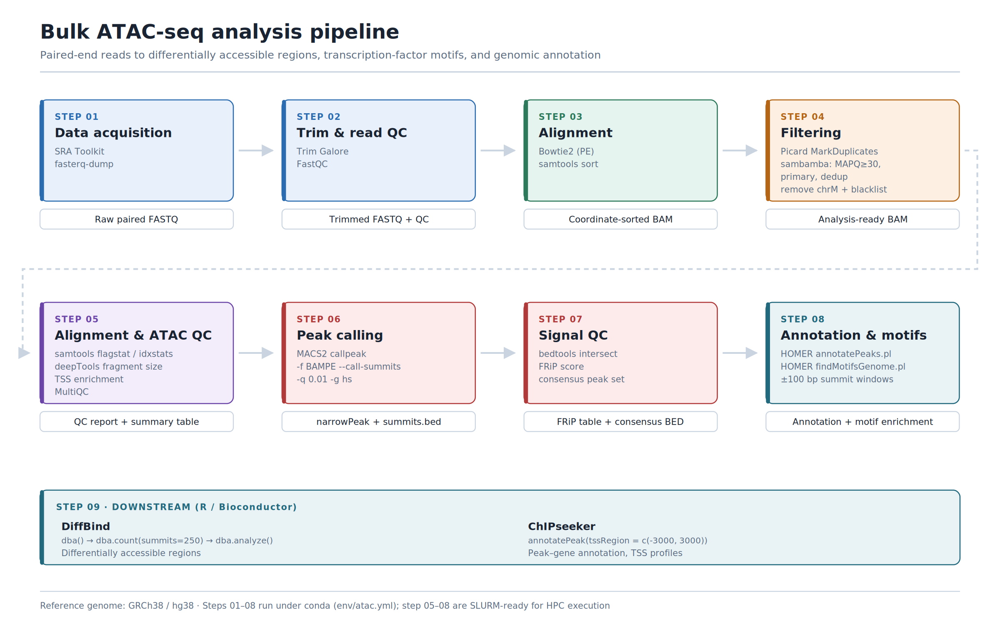
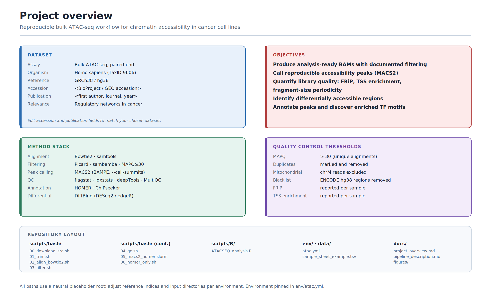

# atac-seq-cancer-pipeline
Reproducible bulk ATAC-seq pipeline for chromatin accessibility in cancer: Bowtie2 alignment, stringent filtering (duplicates, chrM, ENCODE blacklist, MAPQ 30), MACS2 peak calling, FRiP and TSS-enrichment QC, HOMER motif discovery, and DiffBind/ChIPseeker downstream. Conda + SLURM ready. GRCh38.

# Spear-ATAC re-analysis (PRJNA714243 / GEO: GSE168851)

Pooled, droplet-based single-cell CRISPR ATAC-seq re-analysis using publicly available data (Pierce SE et al., Nat Commun, 2021). This repo provides a reusable, HPC-friendly pipeline for alignment (Bowtie2), stringent filtering (sambamba), QC (flagstat/idxstats), peak calling (MACS2), annotation and motif discovery (HOMER), and downstream R workflows (DiffBind/ChIPseeker).

Data source: https://www.ncbi.nlm.nih.gov/bioproject/PRJNA714243

# 👥 Research Team
Bioinformatics team - Horizon Science Communication LLC
https://www.horizon-sci-comm.us/bioinformatics-services

- Hesham Abdullah, PhD 
- Abeer Farag, PhD    
- Ahmed Abdelmaksoud
- Mai Mohamed Salah

Part of the bioinformatics work at
[Horizon Science Communication LLC](https://www.horizon-sci-comm.us/bioinformatics-services).

## Pipeline overview
- Trimmed FASTQs → Bowtie2 alignment (paired-end) → sorted BAM
- sambamba filter to keep primary, uniquely mapped reads: XS==null, not unmapped, not duplicate, MAPQ ≥ 30
- Optional mtDNA exclusion by idxstats
- QC: samtools flagstat + idxstats (MT fraction)
- MACS2 callpeak (BAMPE, --call-summits, -q 0.01)
- FRiP calculation with bedtools intersect
- HOMER annotatePeaks + findMotifsGenome (hg38)
- R: DiffBind and ChIPseeker for DA and annotation

All paths are placeholders rooted at:

/.../path_to_files/bioinformatics/ATAC-Seq/ATAC-sequences/

Adjust REF indices and input directories per your environment.

## Quickstart
1) Create conda env
```
conda env create -f env/atac.yml
conda activate atac
```
2) Align and sort
```
bash scripts/bash/00_align_bowtie2.sh
```
3) Filter with sambamba
```
bash scripts/bash/01_filter_sambamba.sh
```
4) QC summaries
```
bash scripts/bash/02_qc_flagstat_idxstats.sh
```
5) Peak calling + HOMER (SLURM)
```
sbatch scripts/bash/03_macs2_homer.slurm
```
6) R analysis
Open scripts/R/ATACSEQ_analysis.R and update sample_sheet_example.tsv if needed.

### Pipeline



### Project overview



## Citation
- Pierce SE et al. High-throughput single-cell chromatin accessibility CRISPR screens enable unbiased identification of regulatory networks in cancer. Nat Commun. 2021;12:2969.

## License
MIT
